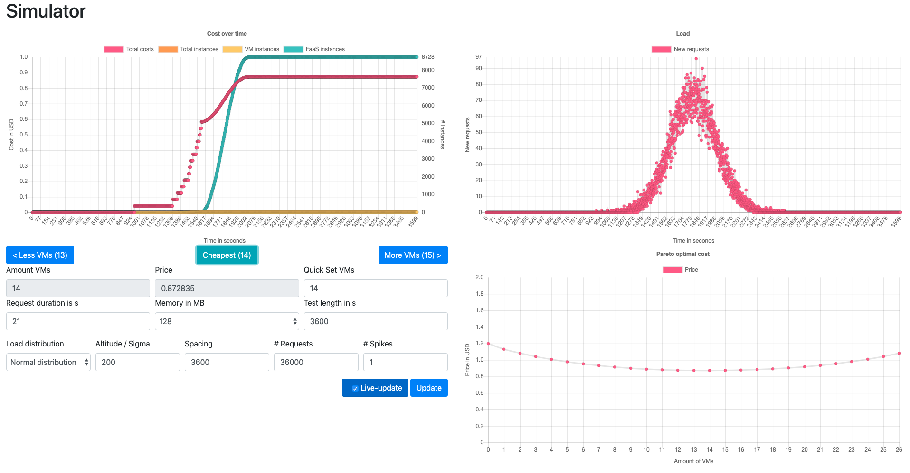

# Deployment Cost Simulator

The <span class="smallcaps">FaasSimulator</span> is an open source
Python 3 application with an easy to use interactive web interface. After the user
defines a specific application load scenario, the tool visualizes the
load and automatically calculates the Pareto optimal cost configuration
across the deployment spectrum, i.e. from pure VMaaS to pure FaaS and
in-between mixed scenarios. In the following we first briefly summarize
the basis on which the simulator operates, and then we use the interface to discuss its features.

## Operational Principle

Internally, the simulator uses a search-based approach to discover how
many resources are required to serve the total amount of requests to a
function of interest for a defined number of temporal intervals. In the
initial phase of each simulation, the tool calculates the number of
incoming (new) and currently under processing requests for each
interval, and compares the foreseen application load against the set of
existing resources in terms of already provisioned VMs. If it is
concluded that the available resources are exceeded, new resources are
provisioned by adding more VMs to the set until needs are met. The total
amount of requests that each VM can serve simultaneously is assumed to
be known and fixed for these purposes, but it can be experimentally
estimated. In the initial iteration, no VMs have been provisioned, so
the provisioned VMs set is empty. At the end of the initial phase, the
total number of VMs required to serve the load has been calculated.

Requests are assigned to the first VM that is able to handle them, that
is, it has not reached the a priori known maximum amount of concurrent
requests per VM. In many cases this is resulting in VMs that are fully
utilized, i.e. having reached their maximum amount of concurrent
requests, whereas others are barely used. In the following phases of the
simulation, the least utilized VM in terms of assigned requests is
removed from the pool, while the requests assigned to it are moved over
to FaaS instances. By iterating over the provisioned VMs set, multiple
hybrid deployment models varying in the amount of used VMs are created
until all VMs are removed. The assumption here is that it is possible to
have the same function (code) deployed both in a FaaS service, and as an
executable function in a VM.

In each phase, the total execution cost is the sum of individual
instance costs for VMs and FaaS instances. Pareto optimality is
subsequently identified by the scenario that results into the minimum
total cost, and can be easily visualized as discussed next. 


## Interface


Starting from the bottom left quadrant of
the screenshot above, the
<span class="smallcaps">FaasSimulator</span> allows users to define the
characteristics of their desired load scenario. The load is
characterized as a function of amount of requests per time interval.
Each request has a (mean) duration as well as an upper bound of resource
consumption, being primary RAM (21 s and 128 MB specifically
in the figure). This is necessary due to the FaaS billing model of the
big cloud service providers offerings. The user is required to input the
mean request duration of the function of interest, as well as the memory
usage based on e.g. previous taken use-case dependent measurements (see
the following section for more on this matter). Additionally, the total
simulation duration in seconds is specified to determine the total
simulation length and with it the total amount of simulation steps.

In the same quadrant, the user can also choose a load distribution
pattern from a set of available ones, along with the corresponding load
distribution parameters. In the example shown in
the screenshot, a normal
distribution with a sigma value of 200
related to the total test length of 3600 simulation steps is chosen
while simulating a total of 36000 requests. Based on the scenario
configuration, the distribution of requests is visualized in the top
right quadrant. Defining such a small sigma for the normal distribution
results into the spike shown in
the upper right quadrant of the screenshot; a larger sigma
value, or a smaller amount of requests in the same length would result
into less dramatic load distributions. Modifying the load values allows
for exploratory insights and answers to what-if questions. At this
point, load models for a constant, normal distribution, sinusoid e.g.
representing day-night cycles, sawtooth, box-pattern and triangle load
are included in the <span class="smallcaps">FaasSimulator</span>
implementation. Nevertheless, custom load models can be added easily by
implementing an interface as shown in and registering it in the `Loads`
class:

``` python
class LoadGeneratorConstant(LoadGenerator):
  def get_load_at(self, timestamp: int):
    return self.altitude

  def get_name(self):
    return "constant"
```

Replaying a previously recorded or generated load is possible by
creating a `LoadGeneratorReplay` instance and passing it a mapping of
`simulation_step` to `request_count`.

The top left quadrant of the screenshot shows the results of the simulation
for the provided parameters as a detailed cost graph. It illustrates the
accumulated number of started VMaaS and FaaS instances as well as cost
in the colours yellow, cyan and magenta, respectively, for a specific
deployment scenario. In the particular case shown in the screenshot, the calculated
Pareto optimal scenario with 14 VMs is chosen. Here, the VMs are able to
handle the load for the first third of the simulated load, while
continuously more VMs are provisioned as the count of requests per
simulation step start ramping up. Based on the simulation outcome, FaaS
instances are more efficiently used to handle the bursty spike when it
arrives. Notice the rise of the cyan line indicating the use of FaaS
instances in the middle of the simulation. Navigation between the
different deployment configurations (in terms of provisioned VMs) is
realized by clicking the buttons at the bottom of this graph.

Finally, the bottom right quadrant visualizes the cost of the various
deployment scenarios as the means for illustrating the Pareto optimal
one. The total cost to handle the defined load is shown as the total
amount of US dollars (y-axis) for a different number of VMs along the
x-axis. In this example, the cost is lowest with 14 VMs, with the
remaining requests being handled by FaaS instances in this hybrid
deployment model. If only VMs were used instead, 26 instances would be
required to handle the same load. As it can be seen in the figure,
handling the same load with either a pure FaaS or VMaaS deployment
scenario results into suboptimality in terms of cost, with the former
being actually slightly more expensive that the latter. If the hybrid
scenarios are not taken into account,
<span class="smallcaps">FaasSimulator</span> can therefore also be used
to answer the simpler FaaS vs VMaaS question.

## Configuration

``` python
# Timing limits of the simulation
self.simulation_start = 0  # in seconds
self.simulation_end = 3600  # in seconds

# Load configuration
self.load_name = None
self.load_altitude = 1
self.load_spacing = 3600
self.load_num_requests = 36000
self.load_num_spikes = 1

# VM configuration
self.vm_parallel = 175
self.request_duration = 30.575  # in seconds

# FaaS configuration
self.request_memory = 229  # in MB
self.faas_performance = {
  128: 19.6545,
  256: 9.594,
  512: 4.191,
  1024: 2.189,
  2048: 1.078
}

# random request generator
self.request_generator_seed = 10
self.request_variation = 0.0  # Percentage
```

<span class="smallcaps">FaasSimulator</span> provides the option to
users to tune it to their particular needs through the
`configuration.py` and the `prices.json` file, in addition to what
parameters are provided through its web interface. The most relevant
parameters of the `configuration.py` file are listed above. The first two
groups of configuration parameters are defining the timing limits of the
simulation and the load distribution to be used. In combination with a set of auxiliary
parameters (not shown here) defining whether to plot the generated data
into an image file and where to store the output, these parameters allow
the simulator to be run fully automated in script mode, outputting the
raw data in CSV files and creating visual plots for different
configurations, without the need of interface interaction.

Further settings that are specified in the `configuration.py` file
regard the VM and FaaS configurations. These settings provide
information about:

  - the number of requests that can be handled concurrently by one VM
    (`vm_parallel`) and the respective expected (mean) execution time
    per request (`request_duration`),

  - the maximum memory (`request_memory`) consumed per request and the
    (mean) execution time per function configuration organized by
    allocated memory size of the configuration (`faas_performance`).

As discussed previously, these parameters can be estimated
experimentally through a tuning process which will be explained in
detail in the following section. In addition, the configuration
parameters `request_generator_seed` and `request_variation` enable the
use of a deterministic request duration randomizer on a specific
percentage of requests. The idea in this case is to introduce noise in
the execution time, closing the gap between the real world and a
possibly overfitted simulation. However, this happens at the expense of
the repeatability of each simulation.

Last, but not least, the pricing information for different FaaS and
VMaaS offerings is read from a separate `prices.json` file, containing a
simple lookup table with the pricing models of both FaaS and VMaaS
offerings to be used by the simulator. This information can be easily
acquired from the Web pages of the public cloud providers. The tool
repository contains a sample prices file which was used for the
simulation runs discussed in the following.

# Tuning the Simulator

A number of configuration parameters have to be adapted to
the specifics of a simulated system. These concern on the one hand the
configuration of the load within the scenario — which can also be
defined through the web interface as discussed in the previous section —
and on the other hand the performance parameters for FaaS and VMaaS
offerings. For this purpose, and since
<span class="smallcaps">FaasSimulator</span> is confined at the time
being to simulating atomic function executions, a reference function is
to be used for the definition of these parameters. For the simulations
executed in this paper, we chose Fast Fourier Transformation (FFT) as an
example computation with high requirements regarding computation as well
as memory consumption which provides interesting insights into how FaaS
services are realized . More specifically, we opted for the
\(O(n\log n)\) Cooley-Tukey-based FFT algorithm as implented by the
`fft-js` library\[1\] (version 0.0.11) of Node.js. Selecting a
JavaScript-based implementation allows us to deploy the same codebase in
both FaaS and VMaaS solutions with minimum effort by using the
`Serverless` framework\[2\].

To simulate the deployment options for the FFT function, the correct
configuration parameters had to be determined by measuring the
performance of the algorithm on both FaaS instances as well as VMs. With
respect to the former, the parameters to be determined for the function
execution on FaaS are the maximum memory consumption of the function
(parameter `request_memory` in ) as well as the performance of the
function on the different FaaS size offerings (`faas_performance`). For
this paper, the performance measurement of FaaS was achieved by
executing the microbenchmark presented in , which executes a set of
functions on the different sized FaaS offerings of the major cloud
providers, including the FFT implementation we chose as a reference
function. However, any function from a similar FaaS-specific benchmark
like  can be used for this purpose instead. For the configuration of the
simulation, the obtained performance measurements for FFT with input
parameter 131072 discrete signals as executed on the different sized
FaaS offerings of AWS are used as listed in [Table 1](#tab:lambda). The
maximum memory consumption, as reported by the microbenchmark, was
measured at 229 MB.


<a name="tab:lambda">Table 1: </a>Performance measurements on AWS Lambda

| Memory size (MB) | Mean response time (ms) |
| :------------------: | :-------------------------: |
|         128          |           19654.5           |
|         256          |            9594             |
|         512          |            4191             |
|         1024         |            2189             |
|         2048         |            1078             |


For the VM configuration part of the simulation, the relevant parameters
are the `request_duration` as well as the number of requests that can be
handled in parallel by a single instance `vm_parallel`. In the
interest of exploring the effect that the VM offering selection has in
the performance of the simulated system we chose to deploy the Node.js
FFT implementation in three different VM types on AWS EC2, as shown in [Table 2](#tab:ec2).
JMeter\[3\] was used to determine the maximum number of requests that
can be handled in parallel by a VM without causing error responses
through a simple saturation process by means of a load ramp-up. More
specifically, JMeter was set up to submit an incrementally increasing
amount of requests in rounds until the Node.js server responded with
error messages. The measurements from the last round without errors are
to be used to configure the relevant parameters of the simulator. The
ones for the VMs selected in our example are shown in [Table 3](#tab:ec2Per). 
The listing in the previous section therefore shows
the configuration settings for running a simulation using `t3.xlarge`
VMs in combination with AWS Lambda calls where 256 MB are allocated per
function.

<a name="tab:ec2">Table 2: </a>AWS EC2 instance details

|                 | `t3.medium` | `t3.large` | `t3.xlarge` |
| :-------------: | :---------: | :--------: | :---------: |
|      vCPU       |      2      |     2      |      4      |
| Memory (\(GB\)) |      4      |     8      |     16      |
|   Price/hour    |   $0.0418   |  $0.0835   |   $0.1670   |


<a name="tab:ec2Per">Table 3: </a>Performance measurements on AWS EC2

|    | `t3.medium` | `t3.large` | `t3.xlarge` |
| :--: | :---------: | :--------: | :---------: |
| Response time (ms) min  |    1750     |    1415    |    1499     |
| Response time (ms) max  |    41071    |   49582    |    59420    |
| Response time (ms) mean |    21413    |   25456    |    30575    |
| Number of requests |  60  |     75      |    175     |             |


An interesting observation here is that the measured performance trend
in Tables [1](#tab:lambda) and [3](#tab:ec2) is different for the two
deployment scenarios, despite using the same reference function.
Doubling the amount of allocated memory in Lambda configurations yields
an improvement of factor 2 in terms of response time. On the other hand,
moving from a `t3.medium` to a `t3.large` VM yields an improvement of
only around 19% with a 25% increase of simultaneous requests supported,
despite the doubling of available memory. Moving from `t3.large` to
`t3.xlarge`, however, improves performance metrics by 20% and 133%,
respectively, showing the sensitivity of the FFT function to the amount
of provisioned CPU (virtual) cores. Notice also that the simulated
scenarios assume an idealised setting with perfect scaling, that is, a
new VM is started exactly before the load exceeds the amount of requests
that can be handled by the currently provisioned virtual machines. This
results in a scenario where each machine is brought up to maximum
utilisation before scaling is applied. In a production deployment
scaling would most likely be applied much earlier (e.g. at 80%
utilization) by means of an autoscaling solution. However, by adjusting
the measurements accordingly, the simulator can also be used to obtain
results for those scenarios.

1.  <https://www.npmjs.com/package/fft-j>

2.  <https://github.com/serverless/serverless>

3.  <https://jmeter.apache.org>

